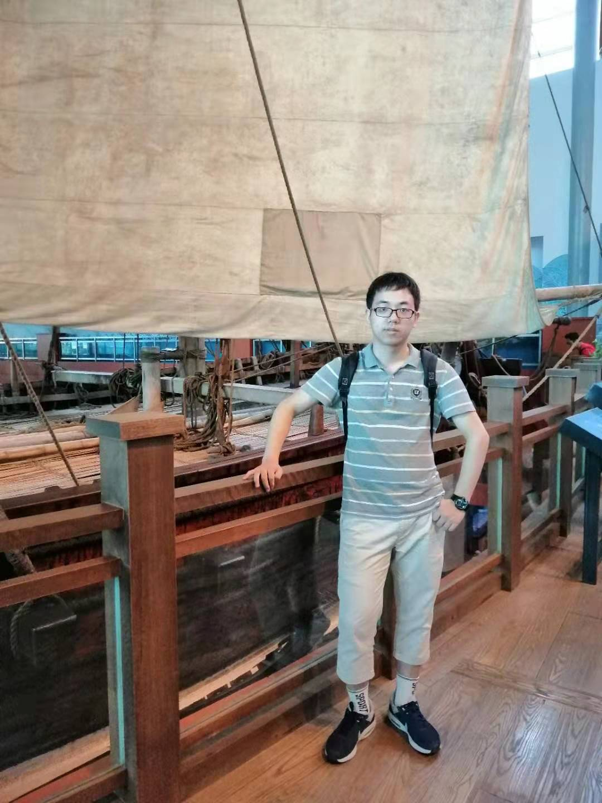

# Zhiyuan Hu

---------------

## EDUCATION BACKGROUND

**Tsinghua University** (Expected 06/2020)

*Department of Computer Science and Technology*

*School of Economics and Management (Minor Degree)*

Ÿ

**Overall GPA: 3.84/4.0  Rank: 9/160**Ÿ

**Core Courses and Grades:**

- *Mathematics related:*

  Calculus A(1) 4.0, Linear Algebra(1) 4.0, Discrete Mathematics(1) 4.0, Calculus A(2) 4.0, Discrete Mathematics(2) 4.0, Introduction to Complex Analysis 4.0, Probability and Statistics 4.0, Numerical Analysis 4.0, Elementary Number Theory 4.0, Linear Algebra(2) 3.6.

- *Programming related:*

  Fundamentals of Programming 4.0, Foundation of Object-Oriented Programming 4.0, Programing and Training 4.0, Assembly Language Programming 4.0, Java Program Design and Training 4.0, Network Programming 4.0. 

- *Artificial Intelligence related:*

  Introduction to Artificial Intelligence 4.0, Artificial Neural Networks 4.0, Pattern Recognition 3.6. 

- *Other major courses:*

  Data Structures 4.0, Computer Network Security Technology 4.0, Formal Languages and Automata 4.0, Operating Systems 4.0, Fundamentals of Computer Graphics 3.6.

## PUBLICATIONS

[1] Cunjun Zhang, Kehua Lei, Jia Jia, Yihui Ma,**Zhiyuan Hu**. AI Painting: An Aesthetic Painting Generation System. In Proceedings of the 26th ACM International Conference on Multimedia (MM'18)([PDF](http://hcsi.cs.jykf64718281.com/Paper/Paper18/MM-LEIKEHUA.pdf))

## RESEARCH & INTERN EXPERIENCES

Research interests：*Computer Vision, Multimedia, Human Computer Interaction.* 

#### Tsinghua University Human-Computer Speech Interaction Research Group (10/2017 – Present)

Advisor：Associate Prof. Jia Jia

#####1.Research on Aesthetic calculation (10/2017 – 06/2018)

Designing an AI Painting system which can automatically generate paintings with specific emotion and art style.

- Using style transfer and emotion transfer to render pictures generated by GAN.
- Analyze the function of each module and verify the effectiveness of our model.
- Co-authored a paper published in **MM’18.**

#####2.Research on Social Network Analysis (07/2018 – 01/2019)

Analyzing unfollow behavior of users on Weibo network and construct a model to predict unfollow.

- Established a benchmark dataset on Sina Weibo (containing 1.8 million users and 400 million edges) with the records of user’s post content.
- Performed data observation on the dataset and revealed key factors (social structure and post contents) related to user’s unfollow behavior.
- Proposed a novel model which outperformed baselines greatly.. 

 

####National University of Singapore NexT++ Research Group (01/2019 – 02/2019)

Advisor: Prof Chua Tat Seng

##### 2.Research on Social Network Analysis

- Further analysis on the mechanism of unfollow. Finding another fatal factor(unfollow history) related to unfollow.
- Improved the former model. The final model outperformed baselines by 24.5% on average in terms of accuracy.
- Submitted a paper to **AAAI 2020**(under review) as co-first author.

 

####Tencent WeChat department (03/2019 – 05/2019)

*Intern staff in Tencent WeChat department*

##### 3.Research on high-quality comment generation

- Generating comments for WeChat moments with high-level semantic information.

- Develop high-speed map reduce algorithm to handle large amount of data.
- Design filters based on statistical analysis to alleviate noise moments.

 

####Carnegie Mellon University Robotics Institute (06/2019 – 09/2019)

Advisor: Prof Martial Hebert

*Summer intern project*

##### 4.Research on Few-Shot Learning in Image Classification

- Analyzing on how to enhance generalizability of visual features with heterogeneous supervision.
- Constructed an benchmark to evaluate the performance and contribution of different supervisions.
- Analyzed the interaction of different supervisions and proposed an unified model to combine them all.
- Improved the performance of Few-Shot learning on Image Classification by 6% in terms of top5 accuracy.
- Planed to submit a paper to**CVPR 2020**as co-first author.

## AWARDS & SCHOLARSHIPS

## SELECTED COURSE PROJECTS

## EXTRACURRICULAR ACTIVITIES

## SKILLS & OTHERS

## CONTATC INFORMATION

Email: zy-hu16@mails.tsinghua.edu.cn

Tel: (86) 18800137721

Address: Tsinghua University, Beijing, 100084, China